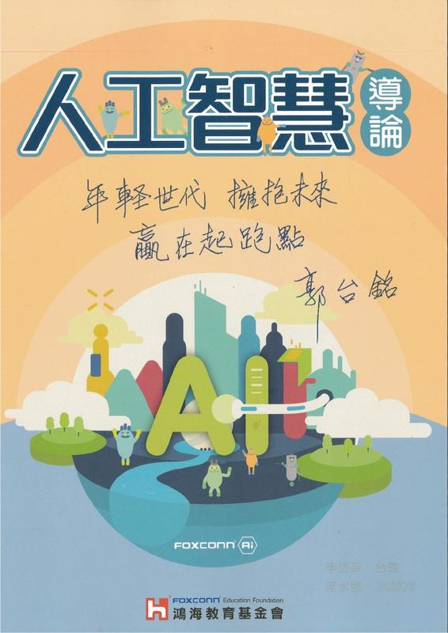

<b>"Introduction to Artificial Intelligence" is an AI textbook written in Chinese for high school students.</b>

<a href="https://www.books.com.tw/products/0010826415" target="_blank">online store</a>
<a href="https://www.facebook.com/foxconnai/?ref=py_c" target="_blank">FB page</a>

Creative AI is the section about Generative Adversarial Networks, including introduction to basic concepts of adversarial learning, vanilla GAN, conditional GAN, and CycleGAN.

</img>

